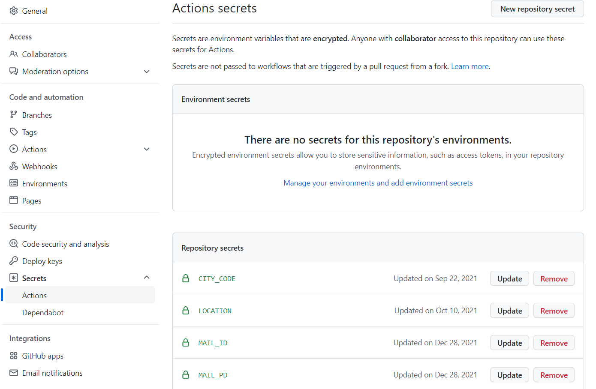
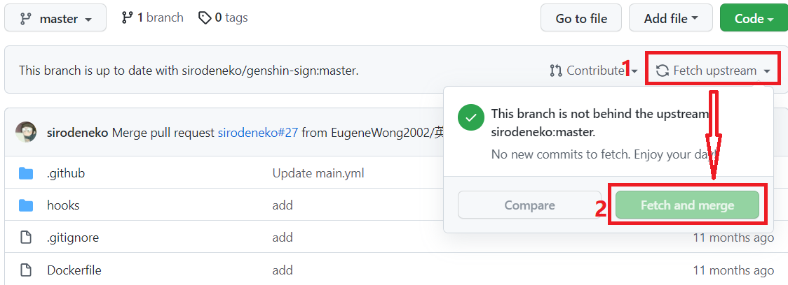

# ZZUjksbDirect
关键词： **健康打卡 郑州大学 健康上报 jksb zzu**

[](https://github.com/ClokMuch/ZZUjksbDirect/actions/workflows/python-app.yml)
[](https://opensource.org/licenses/GPL-3.0/)
[](http://github.com/badges/stability-badges)

&emsp;&emsp;郑州大学健康上报/打卡的自动实现，本方法不再使用无头浏览器模拟登入，而是使用更直接的方式进行，并且更新了可用性.

# 使用说明

## 简述
+ 每日3次定时打卡：2时27分、3时27分、5时27分，建议自行错开分钟时间，避免服务器拥堵导致打卡失败；
+ 所有关键的隐私信息使用 Secrets 保存（只有您一个人知道，除非您开启调试并泄露结果通知邮件），非隐私项目需要自行配置 config.json 设置；
+ 支持打卡失败时邮件提醒（需要自行配制邮件信息）；
+ 项目60天无更新时，自动执行可能会失效，需要再次开启（无需再次配置 Secrets 等）；
+ 若您使用QQ邮箱作为发信邮箱，对应填写邮箱密码请参考QQ邮箱帮助中心步骤，创建授权码，并将授权码作为密码配置.

## 开箱即用的操作指南
**建议使用电脑进行操作**

### 1. 移植仓库到您的账号 
* 在本项目右上角处，点击 fork （注意不要点到数字）（也可以点击 star 成为观星者/天文学家 stargazer）


### 2. 配置您的隐私信息：学号、密码、地址等

* 增加发送邮箱的邮箱名：Name 输入`mail_id`，Value 输入您准备好发送消息邮箱，类似于：`polar10249620@hola.org` **注意：这是一个举例，并非真实的邮箱，如果您直接输入此邮箱，您将接收到错误信息**；
* 增加发送邮箱的邮箱密码：Name 输入 `mail_pd`，Value 输入邮箱密码（QQ邮箱用户输入授权码）；
* 增加需要处理的用户列表：Name 输入 `processing_pool`，Value 输入特定格式的用户信息：
  > 学号，密码，城市码，地理位置，真实姓名，反馈邮箱（接收邮件），可选疫苗接种情况默认3次全部接种，可选的症状或特定情况描述！学号2，密码2，城市码2，地理位置2，真实姓名2，反馈邮箱2

**对于地理位置，现支持修正只读文本框（对应 memo22 ）的获取情况，修正方法：`可自己填写的地理位置框@只读文本框自动获取的位置`，当有多个@存在时，仅解析首个@对应的两侧内容，可参考示例模仿.**

**增加描述配置，对应描述标记与对应选项储存于 `description.json` ，填入 `processing_pool` 不区分大小写和顺序，描述标记填写方法见后文举例，当提及描述标记时，对应的选项将填报为对应的项目，描述标记含义如下：**
```
  fever: myvs_1: 是 您今天是否有发热症状?
  cough: myvs_2: 是 您今天是否有咳嗽症状?
  weakness: myvs_3: 是 您今天是否有乏力或轻微乏力症状?
  sore: myvs_4: 是 您今天是否有鼻塞、流涕、咽痛或腹泻等症状?
  positive: myvs_5: 是 您今天是否被所在地医疗机构确定为确诊病例?
  intimate: myvs_7: 是 您是否被所在地政府确定为密切接触者?
  secondary: myvs_8: 是 您是否被所在地政府确定为次密切?
  hospital: myvs_11: 是 您今天是否被所在地医疗机构进行院内隔离观察治疗?
  central: myvs_12: 是 您今天是否被要求在政府集中隔离点进行隔离观察?
  home: myvs_13: 是 您今日是否被所在地政府有关部门或医院要求居家隔离观察?
  room: myvs_15: 是 共同居住人是否有确诊病例? 
  daily: myvs_9: 做了 您昨天是否按要求参加了核酸检测？（此项目用于特定地区/情况每日检测，当包含此描述标记时，始终将这个选项填报为 做了 ，不包含时默认 没要求做）
```

> **备注：新版 GitHub 更新了部分页面，若您在使用新版 GitHub ，对应 Secrets 参图：**
> 
 **路径：Secrets - Actions - Repository secrets ，添加仍然在右上的位置.**

**注意事项：当日进行核酸检测后应当在想起后主动再次打卡，并正确选择相应的条目.**

**注意事项：分割每一位用户是中文叹号 `！`，分割单个用户具体信息是中文逗号`，`  单个用户使用时不需要添加中文叹号**

举例：
> 2009788745693，eG43&tQgDF2KzF#M，1012，河南省.猫猫市.郑州大学@郑州大学主校区，钱青玉龙，septemberRecever2413@qq.com

或
> 2029788745693，eG4k%QgDF2KzF#M，2625，黑龙江省.风来市.火星蔬菜种植基地，凌墨，septemberRecever2413@qq.com，3，WeaknessSoreCentralDaily！2009788745693，eG43&tQgDF2KzF#M，1012，河北省.新月镇.郑州大学@郑州大学主校区，钱青玉龙，septemberRecever2413@qq.com！2029788745693，eG4k%QgDF2KzF#M，1012iso2625loc黑龙江省.风来市.火星蔬菜种植基地，河北省.新月镇.郑州大学@南极洲中国南极泰山站，武青荷，llrrecs13@163.com，2

**备注：疫苗接种情况对应的值**，对应 "myvs_26"，具体数值如下：

_（默认是 5 ，若已接种第3针则无需指定，不建议通过 config.json 修改默认值，因为直接修改默认值后，在主代码中识别到5时仍然会被配置为修改后的默认值，即修改默认值后，配置单个成员已接种3针仍会被提交为修改后的默认值）_

```
1：已接种第1针剂；
2：已接种第2针剂；
3：尚未接种；
4：有禁忌症，无法接种；
5：已接种第3针剂.
```

**备注：河南省有效城市码**，对应 "myvs_13a", "myvs_13b"，具体数值如下：
```html
<option value="4101">郑州市</option>
<option value="4102">开封市</option>
<option value="4103">洛阳市</option>
<option value="4104">平顶山市</option>
<option value="4105">安阳市</option>
<option value="4106">鹤壁市</option>
<option value="4107">新乡市</option>
<option value="4108">焦作市</option>
<option value="4109">濮阳市</option>
<option value="4110">许昌市</option>
<option value="4111">漯河市</option>
<option value="4112">三门峡市</option>
<option value="4113">南阳市</option>
<option value="4114">商丘市</option>
<option value="4115">信阳市</option>
<option value="4116">周口市</option>
<option value="4117">驻马店市</option>
<option value="4118">济源市</option>
```

### 3. 启用 Action ，开启定时打卡

* 按图片指示顺序点击；
* 随后点击`Run workflow`，运行一次 Action 测试效果.

### 4. 备用：项目更新方法


* 按图片指示顺序点击；
* 若未自行修改/优化代码，则能顺利同步更新；若您优化/修改了代码，您可以自行比对进行更新.


# 结束
* 感谢项目 [d6imde9/ZZUClock](https://github.com/d6imde9/ZZUClock) 提供的 Actions 技巧；
* 如有异常问题，您可以将失败的邮件转发给我（注意删去关键隐私信息），我**不一定**会帮助您处理异常；
* 如您喜欢全球最大的同性交友网站，您可以尝试创建 Issue 来描述您的问题，**请注意不要泄露您的反馈邮件**；
* 也欢迎您通过电邮联系我 1831158739@qq.com （此 QQ 无法添加好友，但您可以直接发送电邮）；
* 本项目随时可能会删库跑路（很快了，大概很快就要跑路了 (｀∇´)
